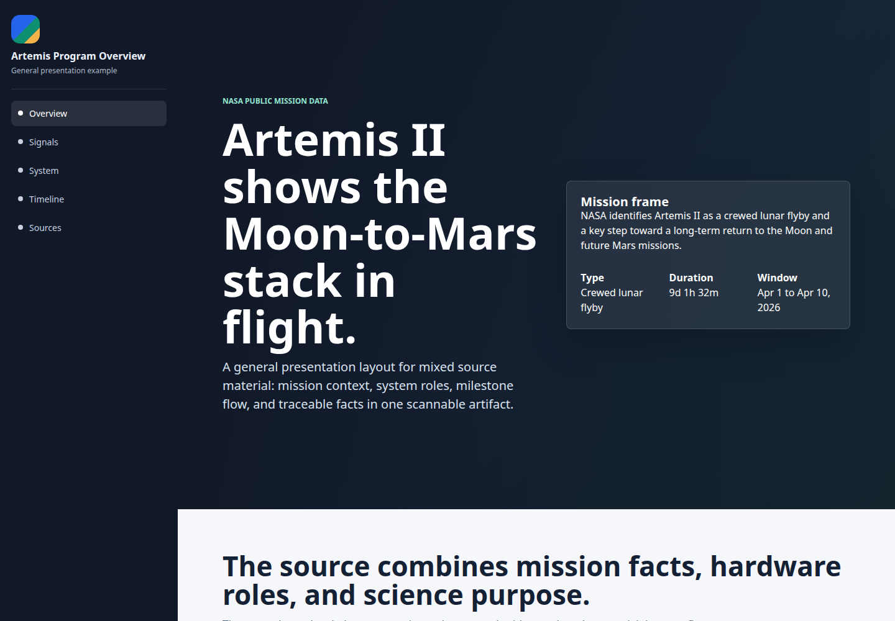
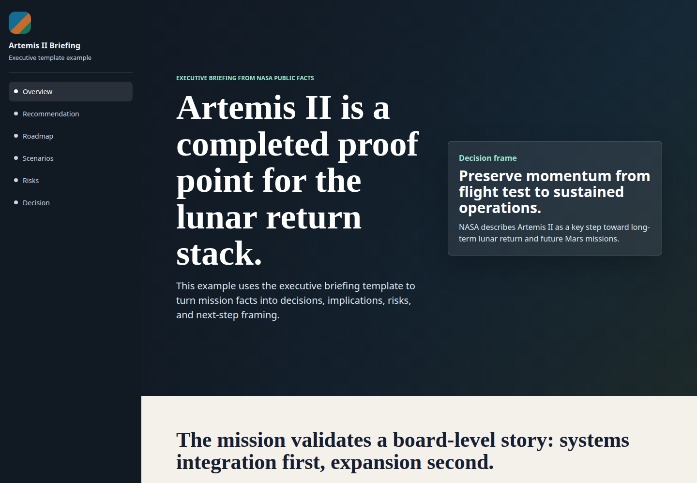
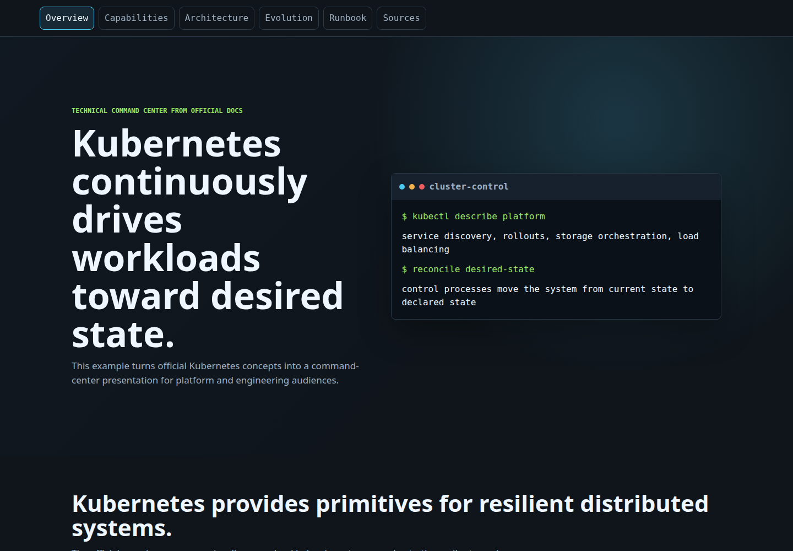
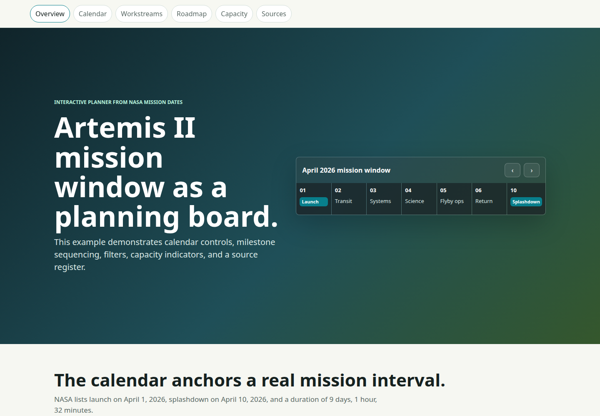
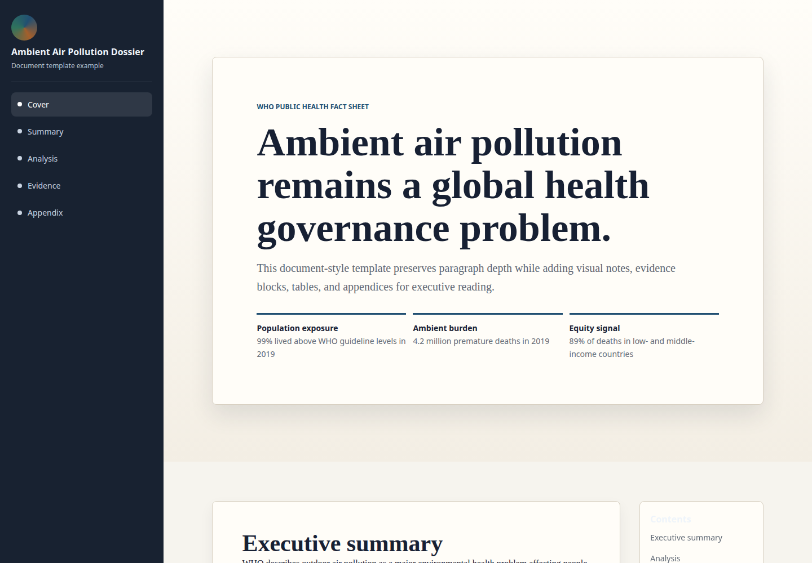

# HTML Presentation Skill

[Português](README.pt-BR.md) | English

## About The Skill

HTML Presentation Skill helps coding agents turn documents, notes, briefs, reports, outlines, or raw content into polished standalone HTML presentations.

It guides the agent through a repeatable workflow: understand the source material, shape the narrative, choose a visual direction, generate a responsive HTML file with embedded CSS and JavaScript, add useful interactions, and validate the result.

The output is designed to replace a slide deck or become a shareable internal page. Presentations can include navigation, progress indicators, cards, metrics, tables, timelines, tabs, accordions, decision sections, and branded visuals when assets are available.

**General presentation**



[Open HTML example](examples/artemis-program-overview.html)

**Executive briefing**



[Open HTML example](examples/artemis-ii-executive-briefing.html)

**Technical command center**



[Open HTML example](examples/kubernetes-command-center.html)

**Interactive planner**



[Open HTML example](examples/artemis-ii-mission-planner.html)

**Document dossier**



[Open HTML example](examples/who-air-pollution-dossier.html)

After installing, ask your agent:

```text
Use the HTML Presentation Skill to transform this document into a polished interactive HTML presentation.
```

## Install

Requirements: Git and Python 3.10+.

Choose one:

**Local project install**

macOS/Linux:

```bash
tmpdir="$(mktemp -d)"
git clone https://github.com/defreitassl/html-presentation-skill.git "$tmpdir"
python3 "$tmpdir/scripts/install.py" --scope local --agents all --project .
```

Windows PowerShell:

```powershell
$tmpdir = Join-Path $env:TEMP "html-presentation-skill"
Remove-Item $tmpdir -Recurse -Force -ErrorAction SilentlyContinue
git clone https://github.com/defreitassl/html-presentation-skill.git $tmpdir
py "$tmpdir\scripts\install.py" --scope local --agents all --project .
```

If `py` is not available on Windows, use `python`.

**Global install**

macOS/Linux:

```bash
tmpdir="$(mktemp -d)"
git clone https://github.com/defreitassl/html-presentation-skill.git "$tmpdir"
python3 "$tmpdir/scripts/install.py" --scope global --agents all
```

Windows PowerShell:

```powershell
$tmpdir = Join-Path $env:TEMP "html-presentation-skill"
Remove-Item $tmpdir -Recurse -Force -ErrorAction SilentlyContinue
git clone https://github.com/defreitassl/html-presentation-skill.git $tmpdir
py "$tmpdir\scripts\install.py" --scope global --agents all
```
