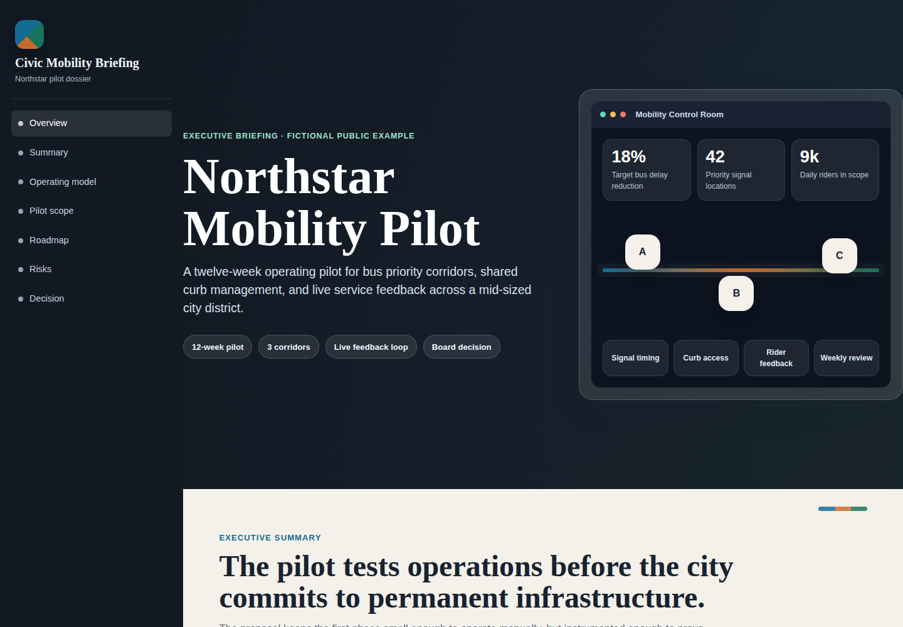
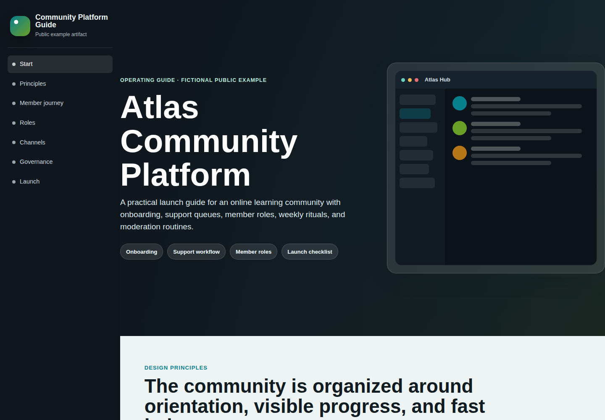

# HTML Presentation Skill

Português | [English](README.md)

## Sobre A Skill

HTML Presentation Skill ajuda agentes de código a transformar documentos, notas, briefs, relatórios, outlines ou conteúdo bruto em apresentações HTML autônomas e bem acabadas.

Ela guia o agente por um fluxo repetível: entender o material de origem, organizar a narrativa, escolher uma direção visual, gerar um arquivo HTML responsivo com CSS e JavaScript embutidos, adicionar interações úteis e validar o resultado.

O resultado pode substituir uma apresentação de slides ou virar uma página interna compartilhável. As apresentações podem incluir navegação, barra de progresso, cards, métricas, tabelas, timelines, abas, acordeões, seções de decisão e identidade visual quando houver assets disponíveis.





Depois de instalar, peça ao seu agente:

```text
Use a HTML Presentation Skill para transformar este documento em uma apresentação HTML interativa e bem acabada.
```

## Instalação

Requisitos: Git e Python 3.10+.

Escolha uma opção:

**Instalação local no projeto**

Use quando quiser que a skill fique disponível apenas no projeto atual. Esta é a melhor opção para Claude Code, GitHub Copilot, Antigravity/agentes genéricos e uso do Codex específico do projeto.

macOS/Linux:

```bash
tmpdir="$(mktemp -d)"
git clone https://github.com/defreitassl/html-presentation-skill.git "$tmpdir"
python3 "$tmpdir/scripts/install.py" --scope local --agents all --project .
```

Windows PowerShell:

```powershell
$tmpdir = Join-Path $env:TEMP "html-presentation-skill"
Remove-Item $tmpdir -Recurse -Force -ErrorAction SilentlyContinue
git clone https://github.com/defreitassl/html-presentation-skill.git $tmpdir
py "$tmpdir\scripts\install.py" --scope local --agents all --project .
```

Se `py` não estiver disponível no Windows, use `python`.

**Instalação global**

Use quando quiser que a skill fique disponível em vários projetos. Ela instala a skill globalmente para Codex e cria instruções globais de ponte para Claude Code, GitHub Copilot e Antigravity/agentes genéricos.

macOS/Linux:

```bash
tmpdir="$(mktemp -d)"
git clone https://github.com/defreitassl/html-presentation-skill.git "$tmpdir"
python3 "$tmpdir/scripts/install.py" --scope global --agents all
```

Windows PowerShell:

```powershell
$tmpdir = Join-Path $env:TEMP "html-presentation-skill"
Remove-Item $tmpdir -Recurse -Force -ErrorAction SilentlyContinue
git clone https://github.com/defreitassl/html-presentation-skill.git $tmpdir
py "$tmpdir\scripts\install.py" --scope global --agents all
```
